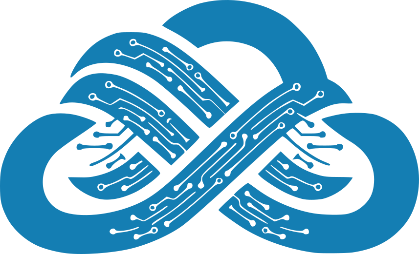

<p align="center">
  
  <p align="center"><strong>Cloud-Native Serverless Model-Context-Protocol (MCP) Server</strong></p>
</p>

<p align="center">
  <a href="https://github.com/fogfish/cloudmcp/releases">
    
  </a>
  <a href="https://github.com/fogfish/cloudmcp/actions/">
    
  </a>
  <a href="http://github.com/fogfish/cloudmcp">
    
  </a>
  <a href="https://coveralls.io/github/fogfish/cloudmcp?branch=main">
    
  </a>
  <a href="LICENSE">
    
  </a>
</p>

> Deploy Model Context Protocol servers to AWS Lambda with zero infrastructure hassle

CloudMCP is a Golang library that simplifies the deployment of **Model Context Protocol (MCP)** servers to **AWS Lambda** behind an **API Gateway**, using AWS CDK for infrastructure-as-code. It bridges the gap between [Model Context Protocol](https://modelcontextprotocol.io) and AWS serverless infrastructure. Write your MCP tools in Go, deploy them as Lambda functions in minutes. No boilerplate, no infrastructure headaches.

## Why `cloudmcp` library?

Building MCP servers is easy. Deploying them to production as a final product with proper authentication, scaling, and monitoring takes real effort. This library removes that friction and gives you a production-ready setup out of the box.


**What you get:**

* **Built on the [official Go MCP SDK](https://github.com/modelcontextprotocol/go-sdk)** ensuring strict protocol correctness, long-term compatibility, and highly performant, production-grade MCP servers by default.
* **Serverless-first architecture** with instant autoscaling, zero server management, pay-only-for-use economics, and a clean developer experience focused entirely on your MCP logic rather than infrastructure.
* **Production-grade security** using battle tests authentication and authorization layers at AWS API Gateway.
* **Pluggable identity providers** with seamless JWT validation using AWS Cognito, Auth0, and others.
* **AWS IAM-based security** for fine-grained permissions, secure service interactions and cloud-native depolyments.
* **Infrastructure as Code** throught version-controlled, reproducible deployments using AWS CDK.
* **Observability out of the box** CloudWatch logs, metrics, and structured tracing for every MCP request.
* **One-command deployment** ship new MCP tools and servers globally with nearly no operational burden.
* **Zero-effort portability to server (long-running) mode** seamlessly switch from Lambda to a persistent server deployment when your scale or latency profile demands it, with no code changes.


## Quick Start

```bash
go get github.com/fogfish/cloudmcp
```

See [examples/helloworld](examples/helloworld) for a complete working example to start with. Below is a minimalistic skeleton of the server. 

Define your MCP tool, add a deployment configuration, run `cdk deploy`.  Your MCP server is now live on API Gateway, ready for AI assistants to call.

```go
import (
  "github.com/modelcontextprotocol/go-sdk/mcp"
  "github.com/fogfish/cloudmcp"
)

// define your tool using **offical Golang SDK**
func Sayer(ctx context.Context, req *mcp.CallToolRequest, input Input) (*mcp.CallToolResult, Output, error) {
  //...
}

// define your server using **offical Golang SDK**
func HelloWorld() (*mcp.Server, error) {
  server := mcp.NewServer(/* ... */)
  return server, nil
}

// deploy MPC server as serverless gateway
func main() {
  cloudmcp.New(server.HelloWorld).
    Hostless().
    AccessApiKey("access", "secret").
    Build()
}
```

## Serverless MCPs

The library provides both a **high-level API** for deploying an entire MCP server as Lambda functions with minimal configuration, and a **low-level API** for advanced, fine-grained control of your infrastructure. Both approaches require a basic understanding of AWS CDK v2, but the low-level API assumes you are writing full IaC, while the high-level API offers a simple yet powerful abstraction that dramatically reduces configuration complexity. Usage of low-level api is required when you are integrating MCPs into exiting cloud-native application, for standalong MCP deployments a high-level api sufficient.


The high-level API uses a builder pattern, where you simply supply a server factory function and the library takes care of wiring, packaging, and deploying your MCP server to Lambda (it auto generates lambda code):

`cloudmcp.New( func() (*mcp.Server, error) )`

It is only mandatory to configure **hosting** and **security** options before deployment.

### Hosting

The MCP server is hosted behind AWS API Gateway. You can deploy it using the default hostname and TLS certificate (so-called **hostless** mode), or provide a custom hostname and TLS certificate. Using a custom domain requires proper configuration of the DNS zone in AWS Route 53 and provisioning the TLS certificate via AWS Certificate Manager (see the official AWS documentation for detailed instructions).

- `.Hostless()` use default hostname as the endpoint
- `.Host(domain, tlsarn)` configure custom endpoint

### Security

Choose your security model with a single method call:

- `.AccessPublic()` - No authentication (development only)
- `.AccessApiKey(access, secret)` - Simple key-based auth
- `.AccessJWT(issuer, audiences...)` - Industry-standard JWT tokens
- `.AccessAwsCognito(poolArn, clients...)` - Integrate with AWS Cognito
- `.AllowAccessIAM(authorizer, principal)` - AWS-to-AWS secure communication


#### IAM Authentication

Since the library enhances auth options with ApiKey and IAM, it offers a simple client library to create a MCP client transport with build-in authentication configuration. See [`pkg/auth`](./pkg/auth)

```go
import (
  "github.com/fogfish/cloudmcp/pkg/auth"
)

transport, err := auth.NewTransportIAM(/* ... */)

client := mcp.NewClient(/* ... */)
client.Connect(context.Backgorund(), transport, nil)
```

### CloudWatch Logs

Automatic log group creation with configurable retention. Logs appear at `/app/{ServerName}` with 5 days retention (adjustable).


### Examples

- **[helloworld](examples/helloworld)** - Minimal MCP Server deployment using high-level api
- **[serverless](examples/serverless)** - Advanced patterns with custom CDK configuration using low-level api

Both examples include working code and deployable with single `cdk deploy` command.


### Use in VS Code

Integration of serverless MCPs is straightforwards as any other, withing `mcp.json`

```json
{
  "servers": {
    "helloworld": {
      "type": "http",
      "url": "https://0000000000.execute-api.eu-west-1.amazonaws.com/api/helloworld",
      "headers": {
        "Authorization": "Basic YWNjZXNzOnNlY3JldA"
      }
    },
  }
}
```

## When to use `cloudmcp` library

✅ You need MCP servers in production, not just local development  
✅ You want serverless benefits: auto-scaling, pay-per-use, zero maintenance  
✅ You use AWS or are willing to deploy there  
✅ You want infrastructure as code with AWS CDK  

❌ You need WebSocket/SSE streaming (Lambda proxy limitations)  
❌ You're committed to a different cloud provider  


## Requirements

- Go 1.25+
- AWS Account
- AWS CDK CLI: `npm install -g aws-cdk`
- Configured AWS credentials


## Related Projects

- [Model Context Protocol](https://modelcontextprotocol.io) - Official MCP specification
- [MCP Go SDK](https://github.com/modelcontextprotocol/go-sdk) - Official Go MCP implementation
- [Scud](https://github.com/fogfish/scud) - Serverless CDK utilities (cloudmcp dependency)


## Contributing

`iq` is [MIT](LICENSE) licensed and accepts contributions via GitHub pull requests:

1. Fork it
2. Create your feature branch (`git checkout -b my-new-feature`)
3. Commit your changes (`git commit -am 'Added some feature'`)
4. Push to the branch (`git push origin my-new-feature`)
5. Create new Pull Request


## License


[](LICENSE)
